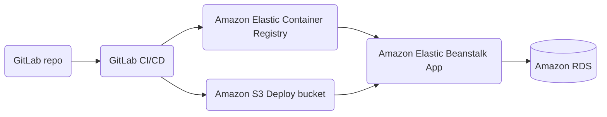

# Task Listing App on AWS

This is a [monorepo](https://github.com/joelparkerhenderson/monorepo_vs_polyrepo) that contains an Angular application at *root* level and also an Express application under `/server`.
You will be deploying this application to Azure.

## The goal

You will deploy this application as a container onto the AWS infrastructure you created using Terraform. The `/server` directory includes a Dockerfile which you can use for this purpose.

### Application Architecture



You may want to take some time here to formulate some questions for things to find out more about and/or to keep in mind as you work through this project.
"How" and "why" questions in particular are good places to start. For example:

- What is an Elastic Container Registry? Why are we using it?
- How will Elastic Beanstalk make use of the S3 bucket?


First of all, congratulations for going through all of the Terraform tasks tasks and completing them. Amazing job!

Feel free to break down and manage the tasks below in any way and order you find convenient for you as a group and for this project. You could, for example, create a project board on your GitLab / Github forked repository.

## Find your way around the app

1. If you're not used to working with web applications in JavaScript, [check out this high-level introduction to the topic](https://github.com/makersacademy/devops-course/blob/main/pills/intro_javascript_webapps.md). It explains some of the main tools and libraries that are common to JavaScript webapps and how these tools work together. This will make it easier to navigate the codebase.

2. Review what you know about Docker as a group: are you able to explain what is happening in the `Dockerfile`? What is a container registry? Why do you think we are using one in this deployment pipeline?

3. Check out the [`.gitlab-ci.yml`](.gitlab-ci.yml) script (or the `.github` directory if using Github Actions). Can you map which parts ofthe `push` and `deploy` jobs correspond to which arrows on the diagram above? You may want to draw a new, more detailed diagram.


## Deploy the app

Now, with all of our resources created on AWS through Terraform, it's time to test the existing CI/CD pipeline for the application living in this repository. 

The `buildAndTest` job (CI) in `.gitlab-ci.yml` should work out of the blue.

However, the `push` and `deploy` (CD) jobs won't work as they are.
Why is that? Can you map the different parts of these jobs onto the diagram and pinpoint where the issues are?

- Note the [variables](https://docs.gitlab.com/ee/ci/variables/) appearing on the `.gitlab-ci.yml` file. You will need to figure out what to set these variables to.

- Are there any other missing credentials you might have to provide to your pipeline in order to get it to work? 

It's always a good idea to check the architecture diagram - an arrow between two components often implies that some credentials might be necessary to make that connection work. For example, can you spot which line in the CI-CD pipeline grants GitLab access to push to your private container registry?

## Test the app manually and get it to load

Once the application is deployed, run a test from your client:

- Can you successfully access the application from the provided URL on AWS? Does it load?
- Can you view tasks and create new tasks? 

If not, how might you find out what's going on?

Before trying to fix anything, try and formulate the root cause for the bug as a team:

> The task listing app running on Elastic Beanstalk is not loading 
>
> ... because the request to X is failing
>
> The request to X is failing
>
> ... because Y is failing
>
> Y is failing 
>
> ... because Z is failing 
>
> ... etc

Keep asking why and tightening the loop around the bug until you get to the underlying reason. 
You will know you've got the underlying reason because finding it will reveal what is missing from your configuration. 

Once you feel clear about what you think is going wrong, get back to your Trello board and have a look at the remaining tasks.

There is a [Tips](#a-few-tips) section as well as some hints below if you get stuck!

Keep it mind that you may find that after fixing the root cause of the initial, new problems are revealed. The debugging process remains the same and the tips and hints will still be relevant. 
Keep going until all the featuers of the task listing app work but keep in mind: the learning lies in following the process and what you discover about the system by debugging it and not so much in getting to the end result. 
So don't worry if you don't get everything working by the end of the week. Rather, focus on [building a good understanding of how the components of system you're building work together](https://itrevolution.com/articles/the-three-ways-principles-underpinning-devops/).

<details>
<summary> :thinking_face: <b>Open me once you've tested your app and tried investigating any bugs you encountered.</b></summary>

If the app isn't loading or some of its functionality doesn't seem to work, open the **Network** tab under your browser DevTools, navigate to `/dashboard` and search for any failed requests.

You may see that a request named `tasks` is failing. What's the response you're getting?
The aim is to get a `200` response but that's probably not what's happening right now.
You may find some useful information about what's going wrong in the Elastic Beanstalk **server logs**.

Spend some time trying to understand what you find in the logs. Check out the [Tips](#a-few-tips) section below for some help with finding the right logs.

If you get stuck trying to understand what the logs mean, check out the next hint below for some more pointers.
</details>

<details>
<summary> :thinking_face: <b>Open me once you've brainstormed some ideas about what might be causing the bugs</b></summary>

The task listing app distributed across (is made up of) two main components:
  - A server running on Elastic Beanstalk
  - A database running on AWS RDS

When encountering errors in a distributed system, it's always a good idea to check whether the different components of the system are actually able to connect to each other.

In that spirit:

- Does your deployed web app actually have any way of knowing about the database connection details right now?
- Is your app able to query the database?

Try and see if you can spot any errors that point at database connection or database querying issues.

Before trying to fix anything, try and formulate the root cause for the bug as a team as well as what you think is missing to fix it. 

Here is an example of what you might say:

> The task listing app running on Elastic Beanstalk is not loading   
>
>   ... because the GET request to `/tasks` fails with a 5xx error
>
> The request fails 
>
>   ... because the app server fails to start
>
> The app server fails to start 
>
> ... because it can't connect to the AWS RDS database, which it tries to do in this file ... at this line ...
>
> The task listing app is unable to connect to the database 
> 
> ... because it doesn't have the correct credentials
>
> In order to connect to the database, the app needs to be provided ... via ...

Once you're really clear about what you think is going wrong, get back to your Trello board and have a look at the remaining tasks.
</details>


## A few tips

### 5xx HTTP Responses

What do HTTP status codes that start with 5 mean? You might encounter some of them as you work on getting this application up and running.

It'd be a good idea to expand your knowledge on [HTTP status codes](https://developer.mozilla.org/en-US/docs/Web/HTTP/Status).
You can use this reference article whenever you find a new status code you haven't come across before!

### Where to find application logs

Under the `Environments` in your Elastic Beanstalk console, you might have found a section called `Logs` from where you can download a whole bunch of differen log files. But which are the relevant ones?

Use the `Request Logs > Last 100 lines` option to get a snippet of all of the different log files.

If you're working on getting Elastic Beanstalk to successfully deploy your Docker image, can you find out what the issue might be from one of these log files?

Or, if you've already deployed it but you found problems when testing it manually, can you spot which ones contain relevant information to help you debug your webapp?

### Finding the right logs

Use the [Elastic Beanstalk docs on logging](https://docs.aws.amazon.com/elasticbeanstalk/latest/dg/using-features.logging.html) to help you figure out which logs contain which information.

In particular, have a look at the `eb-engine.log` file and the log files under `/var/log/eb-docker/containers/eb-current-app/`.

What sort of information can we extract from them? Which parts of the system emit these logs?

You should have all of the information that you need in the application log files.
However, if you have any questions, please check with your peers or ask your coach eventually!


### How the app connects to the database

At startup, the task-listing app server tries to establish a connection to the database using the [Sequelize](https://sequelize.org/) library (an ORM for JavaScript). This is done in [`server/models/index.js`](server/models/index.js) using the `Sequelize` class.

#### Environment variables

Perhaps you've noticed this by looking at the file above: there are some environment variables that need to be set for the application to function correctly. You'll find them in [`server/config/config.js`](server/config/config.js).

Keeping in mind that the main topic of the week is "Infrastructure as code", where should the values of these ideally be configured?

### Initial migration

Once you've managed to connect to the database, you might run into a new problem to solve.

Your database is empty initially and is therefore missing the table(s) that the application expects.

> :question: Can you find the error that points to this in the logs?

What options do you have for running the initial migration on your database?

The [`./server/package.json`]("./server/package.json") file can help you come up with the command you need to run to do this.


<details>
<summary> :thinking_face: <b>Click here for the answer</b></summary>

The `package.json` file has an entry in the `scripts` section that reads:

```
"migrate": "NODE_ENV=test npx sequelize-cli db:migrate"
```

This gives us the command we need to run: `npx sequelize-cli db:migrate`.
We omit the `NODE_ENV=test` because we want to run this in production.

</details>

So we have the command. But where (on which machine) should you run it?
There was a reason you were asked to add an SSH key pair to your Elastic Beanstalk environment ... You can find the instances Elastic Beanstalk creates on your behalf in the EC2 Console. 

**Hint**: Remember that your app is running as a Docker container!


#### Better ways to run migrations

You might be thinking now that this is not a great way to run migrations. After all, you had to do it manually!

That's true, it's not great (why not? what problems could it cause in the future?). Migrations are often the hardest part to automate safely and the topic is beyond the scope of this week. That said, feel free to bring this topic up with your coach if you're interested in exploring it further!

## Resources

- [Viewing logs from Amazon EC2 instances in your Elastic Beanstalk environment](https://docs.aws.amazon.com/elasticbeanstalk/latest/dg/using-features.logging.html)

