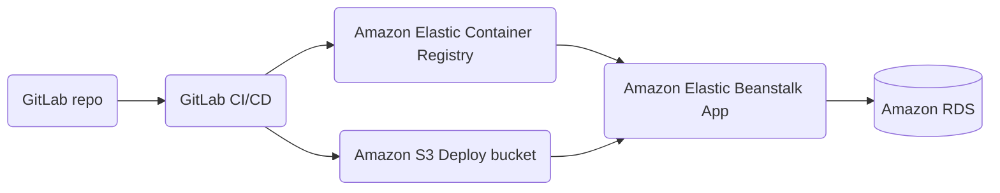

# task-listing-app

This is a [monorepo](https://github.com/joelparkerhenderson/monorepo_vs_polyrepo) that contains an Angular application at *root* level and also an Express application under `/server`.

You will deploy this application on AWS and share it with our friends! Feel free to make any code changes you want, but remember that should not be the focus for this week :relaxed:

## Application Architecture




## Tasks

Feel free to break down and manage the tasks in any way and order you find convenient for you as a group and for this project. You could, for example, create a project board on your GitLab forked repository.

### GitHub Action Workflows

The `buildAndTest` job (CI) under `.gitlab-ci.yml` should work out of the blue.
However, the `push` and `deploy` (CD) jobs won't work as they are, why is that?

## And what's next?

First of all, congratulations for going through all of the previous tasks and completing them. Amazing job!

Now, with all of our resources created on AWS through Terraform, it's time to test our existing CI/CD workflow for the application living in this repository:

- :pencil2: Discuss in your group: are you able to explain what is happening on the `Dockerfile`?

- Can you deploy the application on your existing AWS infrastructure using the existing CI/CD flow? Observe the [variables](https://docs.gitlab.com/ee/ci/variables/) appearing on the `ci-cd.yml` file on the repository. You will need to figure out what to set these variables to. 

:question: Check your understanding. Can you spot which line in the CI-CD pipeline grants GitLab access to push to your private container registry?

If you're having trouble with getting deployment to work, check out some of the tips at the end of this doc.

## Test the app manually

Once the application is successfully deployed, run a test from your client:

- Can you successfully access the application from the provided URL on AWS?
- Any issues querying the database from the web app? Can you connect to it? How does your deployed web app know about the database connection details?

Finally, how could you gain visibility if something goes unexpectedly wrong when trying to access some information within the database? You may find some useful information in the `server logs` ...

To test all this, once your application is deployed, you can open the **Network** tab under your browser DevTools, navigate to `/dashboard` and search for a request named `tasks`, what's the response you're getting? 
 
The aim is to get a `200` but that's probably not what's happening right now.
Check out some of the tips in the next sections to help with investigating that.


## A few tips

### 5xx HTTP Responses

What do HTTP status codes that start with 5 mean? You might encounter some of them as you work on getting this application up and running.

It'd be a good idea to expand your knowledge on [HTTP status codes](https://developer.mozilla.org/en-US/docs/Web/HTTP/Status).
You can use this reference article whenever you find a new status code you haven't come across before!.

### Where to find application logs

Under the `Environments` in your Elastic Beanstalk console, you might have found a section called `Logs` from where you can download a whole bunch of differen log files. But which are the relevant ones?

Use the `Request Logs > Last 100 lines` option to get a snippet of all of the different log files.

If you're working on getting Elastic Beanstalk to successfully deploy your Docker image, can you find out what the issue might be from one of these log files?

Or, if you've already deployed it but you found problems when testing it manually, can you spot which ones contain relevant information to help you debug your webapp?

<details>
<summary> :thinking_face: <b>Click here for some hints</b></summary>

Have a look at the `eb-engine.log` file and the log files under `/var/log/eb-docker/containers/eb-current-app/`

What sort of information can we extract from them? Which parts of the system emit these logs?

</details>

You should have all of the information that you need in the application log files.
However, if you have any questions, please check with your peers or ask your coach eventually!

You got this! :star2:

### Issues connecting to the database

If you've deployed the app and tried creating tasks, you've probably run into some 5xx errors. Perhaps you also noticed in the application logs that the app is having problems connecting to the database.

> :warning: If you haven't, now would be a good time to pause reading and try and spot these errors for yourself!

There is indeed some stuff missing from our configuration to get that working.
Now would be a good time to get back to your Trello board and have a look at the remaining 

#### Environment variables

Perhaps you've noticed this by looking at the files: there are some environment variables that need to be set for the application to function correctly. 

You'll find them in `server/config/config.js`.

Keeping in mind that the main topic of the week is "Infrastructure as code", where should the values of these ideally be configured?

#### Initial migration

Once you've managed to connect to the database, you might run into a new problem to solve.

Your database is empty initially and is therefore missing the table(s) that the application expects.

> :question: Can you find the error that points to this in the logs?

What options do you have for running the initial migration on your database?

The `./server/package.json` file can help you come up with the command you need to run to do this.

<details>
<summary> :thinking_face: <b>Click here for the answer</b></summary>

The `package.json` file has an entry in the `scripts` section that reads:

```
"migrate": "NODE_ENV=test npx sequelize-cli db:migrate"
```

This gives us the command we need to run: `npx sequelize-cli db:migrate`.
We omit the `NODE_ENV=test` because we want to run this in production.

</details>


So we have the command. But where should you run it?

**Hint**: There was a reason you were asked to add an SSH key pair to your Elastic Beanstalk environment ... You can find the instances Elastic Beanstalk creates on your behalf in the EC2 Console.

## Resources

- [Viewing logs from Amazon EC2 instances in your Elastic Beanstalk environment](https://docs.aws.amazon.com/elasticbeanstalk/latest/dg/using-features.logging.html)

