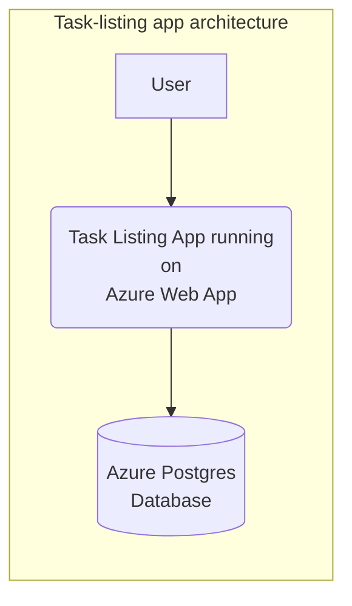
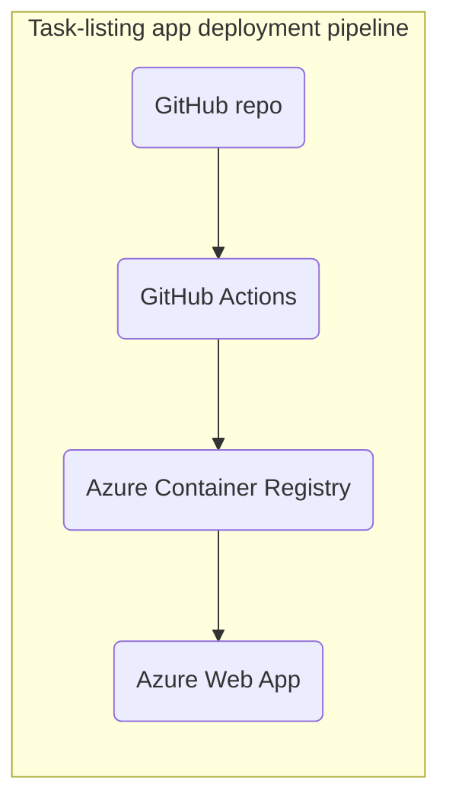

# Deploying a task-listing app using the Azure Web App service

This is a [monorepo](https://github.com/joelparkerhenderson/monorepo_vs_polyrepo) that contains an Angular application at *root* level and also an Express application under `/server`.

You will deploy this application on Azure and share it with our friends! Feel free to make any code changes you want, but remember that should not be the focus for this week :relaxed:

## Table of contents

- [System diagrams](#system-diagrams)
  - [Application diagram](#application-diagram)
  - [Deployment process diagram](#deployment-process-diagram)
- [Getting Started](#getting-started)
- [Deploy the app](#deploy-the-app)
- [Testing the deployed app](#testing-the-deployed-app)
  - [Acceptance criteria](#acceptance-criteria)
  - [Does the app load?](#does-the-app-load)
  - [Debugging in the Cloud](#debugging-in-the-cloud)
  - [Interlude: Let's not forget about Infrastructure as Code!](#interlude-lets-not-forget-about-infrastructure-as-code)
  - [Can a user successfully add and delete tasks?](#can-a-user-successfully-add-and-delete-tasks)
    - [Understanding what's going wrong](#understanding-whats-going-wrong)
    - [Adding tasks](#adding-tasks)
- [A closing note](#a-closing-note)
- [Resources](#resources)


## System diagrams

Below you have been provided with some diagrams that describe the system you have been asked to build in a bit more detail.

Even so, you'll find that they leave some questions unanswered: some arrows have been left unlabelled and the inner workings of some of the tools involved are not explained. The missing bits are for you to research and discover!
It's a good idea to draw your own diagrams and keep updating them as you learn more.

### Application diagram

This is a diagram showing the application architecture once deployed.
It shows a three-tier architecture composed of:
- a webapp running on the Azure Web App service,
- a Postgres database hosted on Azure.



### Deployment process diagram

This diagram gives a high-level overview of the deployment pipeline you are being tasked with building in this project:

1. The code for the app is hosted on GitHub.
2. A GitHub Actions workflow should publish a Docker image containing the task-listing app to the Azure Container Registry.
3. Once published to the registry, the Docker image should be deployed to the Azure Web App service, which will run the app as a container and make it available on the Internet.



## Getting Started

To get started, take some time to familiarise yourself with this codebase.

Are you able to:

1. Explain what you think each line in the [`Dockerfile`][./Dockerfile] is doing?  
  Discuss this in your group.
2. Get the app to run locally on your machine using the provided `Dockerfile`?  
  This will help you refresh your memory of how to work with dockerised applications.
  It can also be useful if you want to for test out commands before you try them in the Cloud.
3. Explain what you think the `buildAndTest` job CI job in the provided GitHub Actions workflow (`.github/workflows/ci-cd.yml`) is doing?

> **Note**: The `buildAndTest` GitHub Actions job should work without changes, but the `deploy` job won't out of the box. Part of your tasks in this project will be to figure out why and get it to work.

## Deploy the app 

In order to successfully deploy this app, you'll have to get the deployment process working as it is described in the above diagram.

As mentioned above, the provided GitHub Actions workflow isn't completely functional, you will need to find out what is missing and make it run successfully.

<details>
<summary>If you get stuck, click here for a hint.</summary>

> Consider the lines containing the string `secrets.` or `env.` in the `ci-cd.yml` file.
> You will need to provide certain values to the workflow so that the machine running the CD job can login into Azure on your behalf, push the Docker image to the Azure Container Registry, and deploy to the Azure Web App.
>
> Let yourself be guided by the error messages in the GitHub Actions job output!
> When in doubt about how to configure a GitHub Action, it's also always a good idea to look up the documentation for the action in question, e.g. [azure/docker-login@v1](https://github.com/Azure/docker-login).
</details>

## Testing the deployed app

### Acceptance criteria

You will know you've successfully deployed the application when your task listing app allows the following actions to be taken without errors:

- loading the app in the browser
- adding new tasks
- viewing new tasks on the dashboard (at `/dashboard`)
- deleting tasks from the dashboard


### Does the app load?

If Azure Web App successfully started running your app, you should see a page like this:


Most likely though, you'll encounter some problems.
For example, you might see a page with a message like this one instead:

```
:( Application Error
If you are the application administrator, you can access the diagnostic resources.
```

Your job now is to get behind more visibility on this problem and try to understand what's going wrong.
Once you think you can understand what the problem is, try to fix it and test the app again.

### Debugging in the Cloud

Here are a few troubleshooting questions that are always good to ask yourself when debugging a system with many components that have to work together:

- Does each component know how to access the other components it needs to access? If not, what information does it need to access these components?
- Does each components of the system have the credentials/permissions it needs to access the other components it needs to access?

Revisit the [application and deployment diagrams](#system-diagrams) to help you with this.

Getting the app to run might take several iterations and some research!

<details>
<summary>Unsure how to get visibility?</summary>

> Finding out how to get access to the Azure Web App's logs would be a good place to start.
> Check out the resources below to help you with that.
</details>

<details>
<summary>Unsure how to pass credentials around?</summary>

> A common way to pass credentials to an application is through **environment variables**.
> Check out some of the resources at the end of this page for further pointers.
</details>

### Interlude: Let's not forget about Infrastructure as Code!

To get your app to run, you may have ended up configuring a bunch of stuff manually through the Azure Portal.

That's okay, but this week's main objective is learning to use Infrastructure as Code! 
We want to keep as much configuration as possible in Terraform to help us document how our system works and allows us version control changes we make.

Before moving on, take some time to research how you might be able to configure the same things through Terraform instead.

It may not always obvious from the available documentation, so do ask your coach for some pointers.

<details>
<summary>Click here for some Terraform hints.</summary>

 > For Azure Web Appps, environment variables and logging can be configured using Terraform using the `app_settings` and `logs` parameters of the `azurerm_linux_web_app` resource, respectively.
</details>

### Can a user successfully add and delete tasks?

Once you can successfully view the app in the browser, the next step is to check whether its functionality works.

Your goal is to make adding new tasks to the list of tasks work successfully. 
It probably won't work out of the box!

What might be going wrong? 
Like in the previous step, try to get visibility on the problem, try to understand what's going wrong, then try to fix it.

<details>
<summary>Unsure where to look?</summary>

> The Chrome DevTools are a good place to start.
> - What kind of request(s) are made when you try to create a new task? 
> - Do they complete successfully?
> - If not, what can you find out more about the meaning of the response status code?
> - What can you find in the application logs?
</details>

#### Understanding what's going wrong

Here are those questions from [the previous section on debugging in the Cloud](#debugging-in-the-cloud) again:

- Does each component know how to access the other components it needs to communicate with? If not, what information does it need to access these components?
- Does each components of the system have the credentials/permissions it needs to access the other components it needs to communicate with?

Refer back to the [deployment process diagram](#deployment-process-diagram) and as always, let yourself be guided by the error messages you find in the logs!

<details>
<summary>Unsure where to start?</summary>

> Referring back to the deployment process diagram shows us that:
> - the Azure Web App needs to be able to retrieve container images from the Azure Container Registry,
> - the Azure Web App needs read and write access to the Postgres database.
>
> Does your Azure Web App have the necessary connection information and credentials to do so?
> Check out the resources below.
>
> The `server/config/config.js` file in this repo should also provide some additional pointers to at least one of the two issues above. Once you've fixed these issues, there may be others, but this should help get you started. 
</details>

#### Adding tasks

Once you've established a means for the different components to talk to each other, you may run into a new problem when trying to add a task.
Here's an additional question one to guide you as you troubleshoot: Is your database set up to have new data inserted into it? If not, what's missing?

Check out the logs again! 

<details>
<summary>Stuck?</summary>

> Remember that we typically need to run **migrations** to make sure a database is set up correctly before the app starts to run.
> Can you find a way to make migrations run whenever the Docker container is run? 
> It will help your understanding and be easier to troubleshoot if you try to get this working locally first. 
>
> :warning: Getting this to work involves making use of a Dockerfile feature that you won't have encountered before, so expect this to take some trial and erorr, as well as research. Do reach out and ask for help from a coach if you need it.
</details>

## A closing note

You've successfully deployed a dockerised app to Azure using Terraform and GitHub actions, well done!

> **Note**: Running migrations automatically as suggested in this project is not always appropriate in a production application, but it's okay for our purposes on this course.
> If you're curious about why running migrations automatically as part of the app deployment can be dangerous, check out [this blog post](https://withatwist.dev/backward-compatible-database-migrations.html).
> And [this blog post](https://benchling.engineering/move-fast-and-migrate-things-how-we-automated-migrations-in-postgres-d60aba0fc3d4?) is a nice illustration of what it takes to make automatic migrations safe(r).


## Resources

- [Azure: Web Apps](https://azure.microsoft.com/en-us/services/app-service/web/)
- [Enable diagnostics logging for apps in Azure App Service](https://docs.microsoft.com/en-us/azure/app-service/troubleshoot-diagnostic-logs)
- [Azure: Configure an App Service app](https://docs.microsoft.com/en-us/azure/app-service/configure-common?tabs=portal)
- [Azure: Configure a custom container for Azure App Service - Configure environment variables](https://docs.microsoft.com/en-us/azure/app-service/configure-custom-container?pivots=container-linux#configure-environment-variables)
- [Azure: Environment variables and app settings in Azure App Service](https://docs.microsoft.com/en-us/azure/app-service/reference-app-settings?tabs=kudu%2Cdotnet#custom-containers)
- [HTTP Headers: Access-Control-Allow-Origin](https://developer.mozilla.org/en-US/docs/Web/HTTP/Headers/Access-Control-Allow-Origin)
- [Troubleshoot HTTP errors of "502 bad gateway" and "503 service unavailable" in Azure App Service](https://docs.microsoft.com/en-us/azure/app-service/troubleshoot-http-502-http-50)

